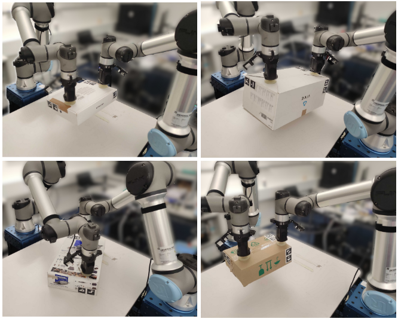
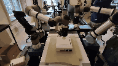
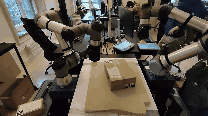
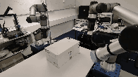
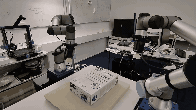

# Dual SERL

<p style="display: flex; align-items: center;">
  
</p>

For detailed information about this project, please refer to the paper included in this repository:  
**[Oliani_two_arms_one_goal.pdf](Oliani_two_arms_one_goal.pdf)**.

## Evaluations

<p style="display: flex; align-items: center;">
  
</p>
<p style="display: flex; align-items: center;">
  
</p>
<p style="display: flex; align-items: center;">
  
</p>

## Contributions

| Code Directory                                                                                             | Description                                |
|------------------------------------------------------------------------------------------------------------|--------------------------------------------|
| [robot_controllers](https://github.com/sebastianooliani/dual-serl/tree/dual_robot/serl_robot_infra/robot_controllers) | Impedance controller for the UR5 robot arm |
| [dual_ur5_env](https://github.com/sebastianooliani/dual-serl/tree/dual_robot/serl_robot_infra/ur_env/)     | Environment setup for the UR5 env |
| [vision](https://github.com/sebastianooliani/dual-serl/tree/dual_robot/serl_launcher/serl_launcher/vision)            | Point-Cloud based encoders                 |
| [utils](https://github.com/sebastianooliani/dual-serl/blob/dual_robot/serl_robot_infra/ur_env/camera/utils.py)        | Point-Cloud fusion and voxelization        |

## Quick start guide for box picking with a UR5 robot arm

### Without cameras (TODO modify the bash files)

1. Follow the installation in the official [SERL repo](https://github.com/rail-berkeley/serl).
2. Check [envs](https://github.com/sebastianooliani/dual-serl/blob/develop/serl_robot_infra/ur_env/envs) and either use the provided [box_picking_env](https://github.com/sebastianooliani/dual-serl/blob/dual_robot/serl_robot_infra/ur_env/envs/camera_env/box_picking_camera_env.py) or set up a new environment using the one mentioned as a template. (New environments have to be registered [here](https://github.com/sebastianooliani/dual-serl/blob/dual_robot/serl_robot_infra/ur_env/__init__.py))
2. Use the [config](https://github.com/sebastianooliani/dual-serl/blob/dual_robot/serl_robot_infra/ur_env/envs/camera_env/config.py) file to configure all the robot-arm specific parameters, as well as gripper and camera infos.
3. Go to the [box picking](https://github.com/sebastianooliani/dual-serl/blob/dual_robot/examples/box_picking_drq) folder and modify the bash files ```run_learner.py``` and ```run_actor.py```. If no images are used, set ```camera_mode``` to ```none``` . WandB logging can be deactivated if ```debug``` is set to True.
4. Record 20 demostrations using [record_demo.py](https://github.com/sebastianooliani/dual-serl/blob/dual_robot/examples/box_picking_drq/record_demo.py) in the same folder. Double check that the ```camera_mode``` and all environment-wrappers are identical to [drq_policy.py](https://github.com/sebastianooliani/dual-serl/blob/dual_robot/examples/box_picking_drq/drq_policy.py).
5. Execute ```run_learner.py``` and ```run_actor.py``` simultaneously to start the RL training.
6. To evaluate on a policy, modify and execute ```run_evaluation.py``` with the specified checkpoint path and step. 
